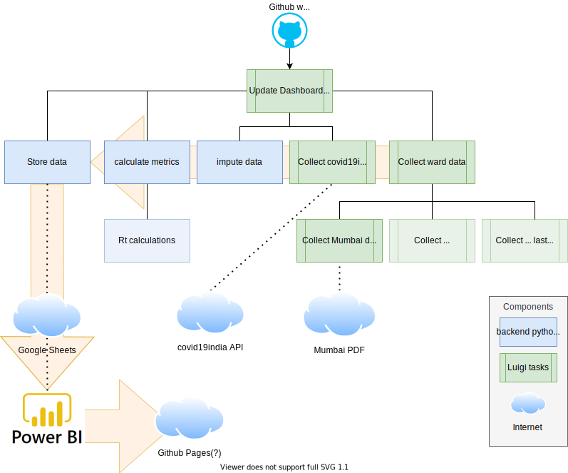

# Backend Covid 19 Dashboard

## status


[](https://github.com/swb-ief/etl-pipeline/actions/workflows/Run_rt_calcs.yml)

# Flow



# Structure

Work in progress: This list should contain only that what we need for phase 2 everything else can be deleted or first
moved to phase 1 archive

```
|   backend.ini                                 [ configuration file for the backend and currently also the luigi tasks]
│   pytest.ini                                  [ Unittest configuration file, includes which folders to check for tests]
│   README.md                                   [ This is me ]
│   requirements.txt
│
├───.github
│   └───workflows
│           code_quality.yml                    [ Code quality validation on push and pull requests ]
│           create_infrastructure.yml           [ Creates the infrastructure needed for the dashboard ]
|           Run_rt_calcs.yml                    [ Calculates rt using R language and R packages ]
│           update_dashboard.yml                [ Main action to update the dashboard ]
├───backend                                     [ Main package with all the code ]
│   │   config.py                               [ handles loading the configuration data ]
│   │
│   ├───data                                    [ data related classes and methods ]
│   │   │   extract_covid19_india_data.py
│   │
│   ├───metrics                                 [ covid 19 related metrics classes and methods ]
│   │   │   calculations.py
│   │
│   ├───repository                              [ repository related classes and methods ]
│   │       gsheet_repository.py
│   │       repository.py
│
├───tasks                                       [ Luigie orgestration tasks executed by github workflow ]
│   │   fetch_covid19_india_data_task.py
│   │   update_gsheet_task.py                   [ Main entrypoint for all the tasks]
│   
├───tests                                       [ Unit tests ]
│   │   test_calculations.py
│   │   test_config.py
│   │   test_extract_covid19_india_data.py
│   │   test_gsheet_repository.py
│   │
│   ├───integration_tests                       [ test interactions of components ]
│   │       README.md
│   │       test_gsheet_repository.py
│   │
│   ├───samples                                 [ data files that are used by tests ]
│   │       covid19india_data-all.json
│   │       Dashboard PDF Development - hospitalization.csv
│   │       Dashboard PDF SWB - city_stats.csv
│   │
│   ├───test output                             [ some test leave artefacts for human inspection ]
│
├───tests_integration                           [ Manual tests to help development ]
│       README.md
│       test_fetch_covid19_india_data_task.py
│       test_update_gsheet_task.py
```

_generated with tree and manually filtered + [manual comments]_

### Tasks vs Backend

Task are lightweight python scripts that manages orgestration of work. As soon as there is a need for more than that
like computations then the actual computation is implemented in the backend python package and the orgestrator just
calls the needed methods to do the work, retaining its orchestration nature

### Tips: testing luigi tasks

When an integration test involving luigi fails it is almost alwasy hidden because luigi hides the exceptions in the
pytest output for that test. So be sure to open the full test run output to find the actual problem.

## Github Actions
```
├───.github
│   └───workflows
│           code_quality.yml                    [ Code quality validation on push and pull requests ]
│           create_infrastructure.yml           [ Creates the infrastructure needed for the dashboard ]
|           Run_rt_calcs.yml                    [ Calculates rt using R language and R packages ]
│           update_dashboard.yml                [ Main action to update the dashboard ]
```

The dashboard uses various github actions that are stored in the .github/workflows folder in yaml files (.yml)

For more information on Github actions in general read [this](https://docs.github.com/en/actions).

### Daily run actions
These actions update the dashboard<br />
|Workflow|Action name|Status|Description|
|--|--|--|--|
|Run_rt_calcs.yml|R proc|[](https://github.com/swb-ief/etl-pipeline/actions/workflows/Run_rt_calcs.yml)|Rt calculations in R|
|update_dashboard.yml|Update Covid 19 dashboard||Main dashboard update|

There progress can be checked on the [Github actions page](https://github.com/swb-ief/etl-pipeline/actions), thats also the location to inspect the log files.

For instance [here](https://github.com/swb-ief/etl-pipeline/runs/2560518985?check_suite_focus=true#step:6:67) you can see that the 5 luigi tasks ran succesfully


## AWS

We use AWS S3 buckets as our storage, there we store computed values as .csv files that are ingested by the PowerBi
Dashboard

### AWS added security

AWS S3 buckets can be further protected by blacklisting the entire internet, and whitelisting powerbi either by
IP-address ranges or by domain names.

## Update dashboard data

Is fully automated trough
a [github workflow action 'Update Covid 19 dashboard'](https://github.com/swb-ief/etl-pipeline/actions/workflows/update_dashboard.yml)

In case of a failure this can be manually triggered with the 'Run workflow' button on that page. <br />
There is no harm in running it twice a day.

## Publish dashboard

1) Follow [these steps](https://docs.microsoft.com/en-us/power-bi/collaborate-share/service-publish-to-web) to get a
   iframe html code snippet
1) Edit [this reports.html](https://github.com/swb-ief/etl-pipeline/blob/gh-pages/docs/report.html) note that this is on
   a **gh-pages** branch that should **not** be merged with main.
1) View the page at [https://swb-ief.github.io/etl-pipeline/report](https://swb-ief.github.io/etl-pipeline/report)
