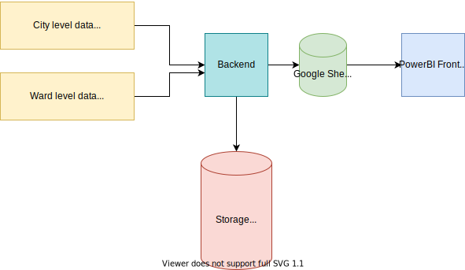

# Workflow



## Dashboard Dependencies and Pipeline Description (Draft)

|               Graph               |  Sheets used  |        Columns used       | Documented | Code                                      |Source|Action|
|:---------------------------------:|:-------------:|:-------------------------:|:----------:|:-----------------------------------------:|:---|:---|
|           City dropdown           |    metrics    |          district         |     n/a    |pipeline/pipeline/extract_history_file.py|covid19india API|LuigiPipelineSchedule/Manual|
|            Date slicer            |    metrics    |            date           |     n/a    |pipeline/pipeline/extract_history_file.py|covid19india API|LuigiPipelineSchedule/Manual|
|           Summary stats           |    metrics    |      delta.confirmed      |     n/a    |pipeline/pipeline/calculate_metrics_file.py|covid19india API|LuigiPipelineSchedule/Manual|
|           Summary stats           |    metrics    |       delta.deceased      |     n/a    |pipeline/pipeline/calculate_metrics_file.py|covid19india API|LuigiPipelineSchedule/Manual|
|           Summary stats           |    metrics    |        delta.tested       |     n/a    |pipeline/pipeline/calculate_metrics_file.py|covid19india API|LuigiPipelineSchedule/Manual|
|           Summary stats           |    metrics    |      delta.recovered      |     n/a    |pipeline/pipeline/calculate_metrics_file.py|covid19india API|LuigiPipelineSchedule/Manual|
|           Summary stats           |    metrics    |            date           |     n/a    |pipeline/pipeline/extract_history_file.py|covid19india API|LuigiPipelineSchedule/Manual|
|           Summary stats           |    metrics    |     delta.hospitalized    |     n/a    |pipeline/pipeline/calculate_metrics_file.py|covid19india API|LuigiPipelineSchedule/Manual|
| Case growth rate and active cases |    metrics    | delta.percent.case.growth |     n/a    |pipeline/pipeline/calculate_metrics_file.py|covid19india API|LuigiPipelineSchedule/Manual|
| Case growth rate and active cases |    metrics    |       spline.active       |     n/a    |pipeline/pipeline/calculate_metrics_file.py|covid19india API|LuigiPipelineSchedule/Manual|
|             Fatalities            |    metrics    |       delta.deceased      |     n/a    |pipeline/pipeline/calculate_metrics_file.py|covid19india API|LuigiPipelineSchedule/Manual|
|             Fatalities            |    metrics    |      spline.deceased      |     n/a    |pipeline/pipeline/calculate_metrics_file.py|covid19india API|LuigiPipelineSchedule/Manual|
|             Fatalities            |    metrics    |            date           |     n/a    |pipeline/pipeline/extract_history_file.py|covid19india API|LuigiPipelineSchedule/Manual|
|               Tests               |    metrics    |        delta.tested       |     n/a    |pipeline/pipeline/calculate_metrics_file.py|covid19india API|LuigiPipelineSchedule/Manual|
|               Tests               |    metrics    |            date           |     n/a    |pipeline/pipeline/extract_history_file.py|covid19india API|LuigiPipelineSchedule/Manual|
|               Tests               |    metrics    |     MA.21.daily.tests     |     n/a    |pipeline/pipeline/calculate_metrics_file.py|covid19india API|LuigiPipelineSchedule/Manual|
|          Hospitalizations         |    metrics    |            date           |     n/a    |pipeline/pipeline/extract_history_file.py|covid19india API|LuigiPipelineSchedule/Manual|
|          Hospitalizations         |    metrics    |     delta.hospitalized    |     n/a    |pipeline/pipeline/calculate_metrics_file.py|covid19india API|LuigiPipelineSchedule/Manual|
|          Hospitalizations         |    metrics    |    spline.hospitalized    |     n/a    |pipeline/pipeline/calculate_metrics_file.py|covid19india API|LuigiPipelineSchedule/Manual|
|             Recoveries            |    metrics    |            date           |     n/a    |pipeline/pipeline/extract_history_file.py|covid19india API|LuigiPipelineSchedule/Manual|
|             Recoveries            |    metrics    |      delta.recovered      |     n/a    |pipeline/pipeline/calculate_metrics_file.py|covid19india API|LuigiPipelineSchedule/Manual|
|             Recoveries            |    metrics    |      spline.recovered     |     n/a    |pipeline/pipeline/calculate_metrics_file.py|covid19india API|LuigiPipelineSchedule/Manual|
|        Test positivity rate       |    metrics    |            date           |     n/a    |pipeline/pipeline/calculate_metrics_file.py|covid19india API|LuigiPipelineSchedule/Manual|
|        Test positivity rate       |    metrics    |   MA.21.delta.positivity  |     n/a    |pipeline/pipeline/calculate_metrics_file.py|covid19india API|LuigiPipelineSchedule/Manual|
|        Test positivity rate       |    metrics    |      delta.positivity     |     n/a    |pipeline/pipeline/calculate_metrics_file.py|covid19india API|LuigiPipelineSchedule/Manual|
|         Reproduction rate         |       Rt      |            date           |     n/a    |R_scripts/push_Rt_to_gsheets.py | city_stats |R_proc|
|         Reproduction rate         |       Rt      |         mean.mean         |     n/a    |R_scripts/push_Rt_to_gsheets.py | city_stats |R_proc|
|         Reproduction rate         |       Rt      |       CI_lower.mean       |     n/a    |R_scripts/push_Rt_to_gsheets.py | city_stats |R_proc|
|         Reproduction rate         |       Rt      |       CI_upper.mean       |     n/a    |R_scripts/push_Rt_to_gsheets.py | city_stats |R_proc|
|           Doubling time           | doubling_time |       doubling.time       |     n/a    |R_scripts/push_Rt_to_gsheets.py | city_stats |R_proc|
|           Doubling time           |    metrics    |      delta.confirmed      |     n/a    |pipeline/pipeline/calculate_metrics_file.py|covid19india API|LuigiPipelineSchedule/Manual|
|           Doubling time           |    metrics    |            date           |     n/a    |pipeline/pipeline/extract_history_file.py|covid19india API|LuigiPipelineSchedule/Manual|
|           Levitt metric           |    metrics    |            date           |     n/a    |pipeline/pipeline/extract_history_file.py|covid19india API|LuigiPipelineSchedule/Manual|
|           Levitt metric           |    metrics    |       levitt.Metric       |     n/a    |pipeline/pipeline/calculate_metrics_file.py|covid19india API|LuigiPipelineSchedule/Manual|

## Dependencies

### 1) calculate_metrics

- Currently, the primary function, calculate_metrics(), outputs csv's to output/percentages_for_hospitalizations.csv and
  output/city_metrics.py
- In some of the existing docs, calculate_metrics.py is executed as part of the CalculateCityMetricsTask; however, that
  task or its wrapper task, SWBPipelineWrapper is not found (see the etl-pipeline/pipeline README) in any of the
  existing github action workflows.
- In the pipeline and pipeline-schedule task, `pipeline.tasks.spreadsheets AllDataGSheetTask` is
  run. [AllDataGSheetTask](https://github.com/swb-ief/etl-pipeline/blob/6e1096d0b170103504e68df71e4c849f2abe3188/pipeline/pipeline/tasks/spreadsheets.py#L32)
- The code call structure below shows when in the command flow pipeline/pipeline/calculate_metrics_file.py (specifically
  the **calculate_metrics** method) is called.

**code call structure**

```
.github/workflows/pipeline-schedule.yml (with call: python -m luigi --module pipeline.tasks.spreadsheets ...)
.github/workflows/pipeline.yml (with call: python -m luigi --module pipeline.tasks.spreadsheets ...)
  -> pipeline/pipeline/tasks/spreadsheets.py
    -> pipeline/pipeline/extract_history_file.py
      -> pipeline/pipeline/calculate_metrics_file.py
```

### 2) Ward data
Ward-wise Time series for Daily confirmed cases, Daily deaths, Daily Tests, Cumulative cases, Cumulative Deaths.

**code call structure**
```
-- population of ward_metrics tab in google sheet


```

**source:** gsheet <br />
- not available from any source other than google sheet

**destination:** gsheet <br />
[ward_metrics](https://github.com/swb-ief/etl-pipeline/blob/master/pipeline/pipeline/ward_metrics.py) <br />
call's
-> [ward_data_computation](https://github.com/swb-ief/etl-pipeline/blob/master/pipeline/pipeline/ward_data_computation.py)


### 3) Rt data
**updating 'Rt' and 'doubling_time'**

- [Old Readme](https://github.com/swb-ief/etl-pipeline/blob/827dbaca2676533e235232feedb83ab96b6077ac/README.md)    
- [input/output google sheet](https://docs.google.com/spreadsheets/d/1HeTZKEXtSYFDNKmVEcRmF573k2ZraDb6DzgCOSXI0f0/edit#gid=0)

**code call structure**
```
populating of city_stats tab of input/output google sheet (source data api?)
-> etl-pipeline/pipeline/pipeline/tasks/spreadsheets
  -> etl-pipeline/pipeline/pipeline/config 
    -> WORKSHEET_URL = os.getenv("SWB_WORKSHEET_URL", DEFAULT_WORKSHEET_URL)

.github/workflows/Run_rt_calcs.yml (with call: python R_scripts/push_Rt_to_gsheets.py)
  -> run R_scripts/Rt_calcs.R
    -> read data from city_stats sheet in input/output google sheet
        -> Perform Doubling time calculations and write the output to '/usr/data/dt_mumbai.csv' (this changed?)
        -> Perform Rt calculations and write the output to /usr/data/epinow2_out.csv 
  
  -> run R_scripts/push_Rt_to_gsheets.py
    -> reads results from /usr/data/epinow2_out.csv and /usr/data/dt.csv  --(not dt_mumbai.csv ?)
    -> writes output to input/output google sheet
```


